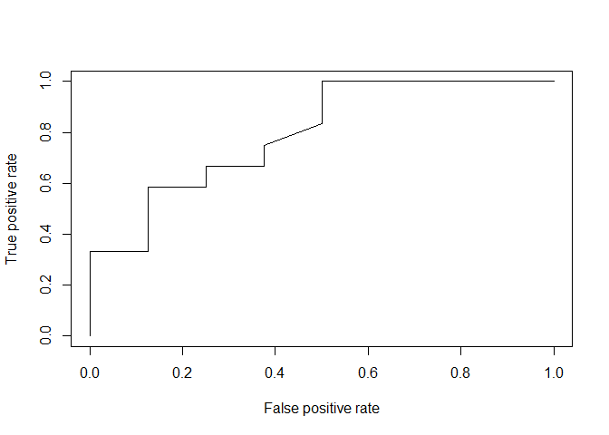

LDA
================

``` r
library(MASS)
purchase = read.table("C:/Users/Choi Sung Wook/Desktop/대학원/머신러닝 dataset/purchase.txt", header=T)
```

``` r
head(purchase)
```

    ##   seq age income credit purchase
    ## 1   1  25    150   양호     구매
    ## 2   2  34    220   우수   비구매
    ## 3   3  27    210   양호   비구매
    ## 4   4  28    250   양호     구매
    ## 5   5  21    100   나쁨   비구매
    ## 6   6  31    220   양호   비구매

``` r
attach(purchase)
```

    ## The following object is masked _by_ .GlobalEnv:
    ## 
    ##     purchase

``` r
purchase.lda = lda(purchase~age+income, data=purchase)
```

``` r
pred.lda = predict(purchase.lda, purchase)
names(pred.lda)
```

    ## [1] "class"     "posterior" "x"

``` r
pred.lda$class
```

    ##  [1] 비구매 구매   비구매 비구매 비구매 비구매 구매   비구매 비구매 비구매
    ## [11] 구매   비구매 구매   비구매 구매   비구매 비구매 비구매 구매   비구매
    ## Levels: 구매 비구매

``` r
head(pred.lda$posterior, 3)
```

    ##        구매    비구매
    ## 1 0.1526916 0.8473084
    ## 2 0.5808760 0.4191240
    ## 3 0.2397764 0.7602236

``` r
table(pred.lda$class, purchase$purchase)
```

    ##         
    ##          구매 비구매
    ##   구매      4      2
    ##   비구매    4     10

이차함수까지 고려한 LDA = QDA(Qudratic)

``` r
purchase.qda = qda(purchase~age+income, data=purchase)
pred.qda = predict(purchase.qda, purchase)
```

``` r
head(pred.qda$posterior, 3)
```

    ##        구매    비구매
    ## 1 0.1890451 0.8109549
    ## 2 0.3457333 0.6542667
    ## 3 0.2020425 0.7979575

``` r
table(pred.qda$class, purchase$purchase)
```

    ##         
    ##          구매 비구매
    ##   구매      4      1
    ##   비구매    4     11

``` r
boxplot(purchase)
```


