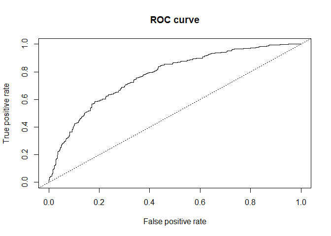

Untitled
================

``` r
german = read.table("C:/Users/Choi Sung Wook/Desktop/대학원/머신러닝 dataset/german.txt", col.names=c("X1","X2","X3","X4","X5","X6","Y"))
```

범주형 변수를 0,1 로 처리

``` r
options(contrasts=c("contr.treatment","contr.poly"))
```

``` r
german.object = glm(Y~., family=binomial, data=german)
summary(german.object)
```

    ## 
    ## Call:
    ## glm(formula = Y ~ ., family = binomial, data = german)
    ## 
    ## Deviance Residuals: 
    ##     Min       1Q   Median       3Q      Max  
    ## -1.7920  -0.8008  -0.4739   0.9345   2.4309  
    ## 
    ## Coefficients:
    ##              Estimate Std. Error z value Pr(>|z|)    
    ## (Intercept)  0.639229   0.548404   1.166 0.243770    
    ## X1A12       -0.529097   0.186515  -2.837 0.004558 ** 
    ## X1A13       -1.068687   0.338881  -3.154 0.001613 ** 
    ## X1A14       -1.896456   0.206609  -9.179  < 2e-16 ***
    ## X2           0.034279   0.006335   5.411 6.26e-08 ***
    ## X3A31       -0.099085   0.475383  -0.208 0.834892    
    ## X3A32       -0.946437   0.370723  -2.553 0.010681 *  
    ## X3A33       -0.932929   0.433410  -2.153 0.031355 *  
    ## X3A34       -1.529324   0.394022  -3.881 0.000104 ***
    ## X4           0.016851   0.072055   0.234 0.815086    
    ## X5          -0.013126   0.007340  -1.788 0.073741 .  
    ## X6          -0.008361   0.218890  -0.038 0.969530    
    ## ---
    ## Signif. codes:  0 '***' 0.001 '**' 0.01 '*' 0.05 '.' 0.1 ' ' 1
    ## 
    ## (Dispersion parameter for binomial family taken to be 1)
    ## 
    ##     Null deviance: 1221.7  on 999  degrees of freedom
    ## Residual deviance: 1019.2  on 988  degrees of freedom
    ## AIC: 1043.2
    ## 
    ## Number of Fisher Scoring iterations: 4

Residual deviance 1019.2 가 자유도 988 과 비슷하므로, 모형 적합이 잘 되었다고 볼 수 있다. X3 의 첫 번째 수준, X4, X6 은 설명력이 떨어진다. (p-value 값이 크다) -&gt; 이 변수들 빼고 새로 적합해도 됨.

``` r
table(german$X1)
```

    ## 
    ## A11 A12 A13 A14 
    ## 274 269  63 394

X1 의 범주의 수가 4개이므로, 이를 처리하기 위한 가변수(dummy variable)는 4-1=3개 필요함.

불량고객이 될 확률 : P(Y=1) 에 대한 추

``` r
phat = german.object$fitted.values
german1 = cbind(german, phat)
german1[c(1:10),]
```

    ##     X1 X2  X3 X4 X5 X6 Y       phat
    ## 1  A11  6 A34  4 67  1 0 0.18170622
    ## 2  A12 48 A32  2 22  1 1 0.63312134
    ## 3  A14 12 A34  3 49  2 0 0.04812842
    ## 4  A11 42 A32  4 45  2 0 0.64393801
    ## 5  A11 24 A33  4 53  2 1 0.47102819
    ## 6  A14 36 A32  4 35  2 0 0.20127115
    ## 7  A14 24 A32  4 53  1 0 0.11736527
    ## 8  A12 36 A32  2 35  1 0 0.49091316
    ## 9  A14 12 A32  4 61  1 0 0.07351067
    ## 10 A12 30 A34  2 28  1 1 0.32453104

오즈 는 계수를 exp 취한 것.

``` r
coef = german.object$coef
odds = exp(coef)
cbind(coef, odds)
```

    ##                     coef      odds
    ## (Intercept)  0.639228569 1.8950184
    ## X1A12       -0.529097166 0.5891366
    ## X1A13       -1.068686593 0.3434593
    ## X1A14       -1.896456189 0.1500996
    ## X2           0.034278544 1.0348728
    ## X3A31       -0.099084633 0.9056661
    ## X3A32       -0.946437486 0.3881213
    ## X3A33       -0.932929438 0.3933996
    ## X3A34       -1.529323814 0.2166821
    ## X4           0.016851452 1.0169942
    ## X5          -0.013126135 0.9869596
    ## X6          -0.008361031 0.9916738

다른 독립변수들이 일정할 때 X2 가 한 단위 증가하면 불량고객이 될 확률에 대한 오즈는 exp(0.034)=1.03 배, 즉 3% 증가한다. 이산형 변수는 가변수를 활용 ex.) X1A12 ; X1A11 을 기준으로 해서 해석. X1A12 는 X1A11 보다 승산이 0.58 배 (42% 감소)

``` r
library(ROCR)
```

    ## Warning: package 'ROCR' was built under R version 3.6.1

    ## Loading required package: gplots

    ## Warning: package 'gplots' was built under R version 3.6.1

    ## 
    ## Attaching package: 'gplots'

    ## The following object is masked from 'package:stats':
    ## 
    ##     lowess

``` r
predt = predict(german.object, newdata=german, type="response")
rocpredt = prediction(predt, german$Y)
perf = performance(rocpredt, "tpr", "fpr")
plot(perf)
title("ROC curve")
abline(0,1, lty=3)
```

 모형의 적합도 측정 - 일반적인 판별분석의 성능 평가 방법 - 절대값이 고정된 경우 평가할 있는 분할표 방식과, - 여러 cut-off 값에 대해 볼 수 있는 ROC 곡선법이 있음.

분할표 방식은 "정/오분류율" 보여줌. 계산은 간단하나, 모델의 성능 과대평가 경향이 있다.
