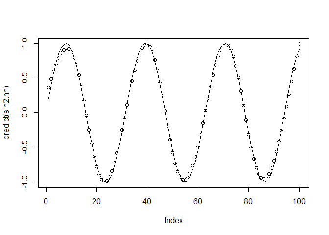
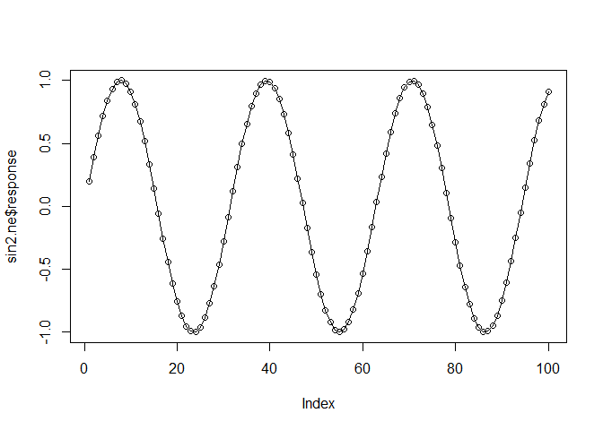
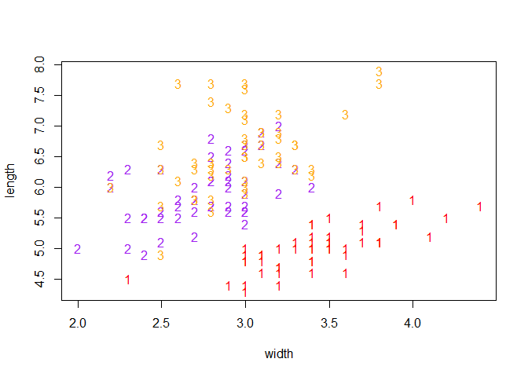
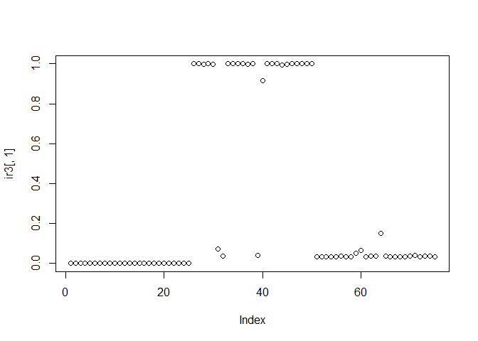
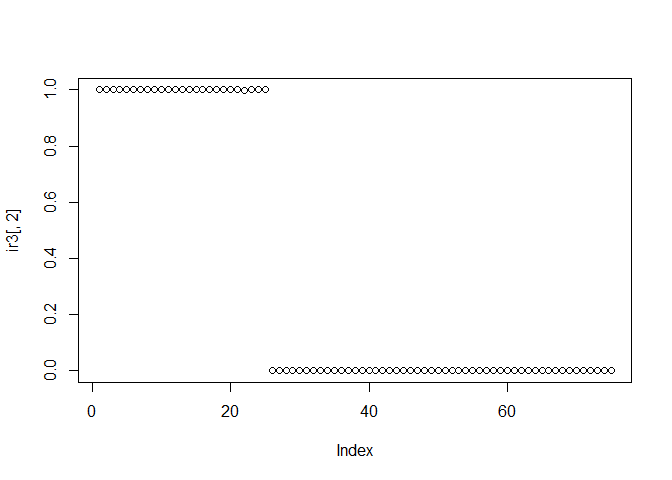
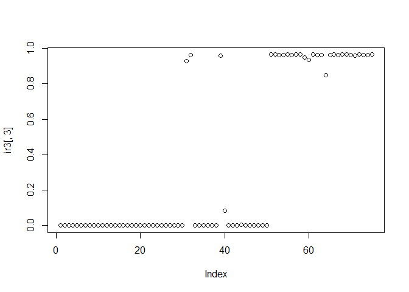

Neural Network
================

``` r
library(nnet)
```

``` r
inp1 = 1:100
inp2 = inp1/100
sin2 = sin(inp2*20)
sin2.nn = nnet(sin2~inp2, size=5, decay=1e-3, 
               linout=T, rang=2, maxit=5000)
```

    ## # weights:  16
    ## initial  value 1206.353722 
    ## iter  10 value 47.523883
    ## iter  20 value 45.571577
    ## iter  30 value 45.163123
    ## iter  40 value 43.049687
    ## iter  50 value 35.393387
    ## iter  60 value 33.387698
    ## iter  70 value 29.866079
    ## iter  80 value 25.760129
    ## iter  90 value 22.714638
    ## iter 100 value 21.603820
    ## iter 110 value 20.118726
    ## iter 120 value 15.931582
    ## iter 130 value 12.987415
    ## iter 140 value 9.920684
    ## iter 150 value 3.985007
    ## iter 160 value 3.189950
    ## iter 170 value 3.139951
    ## iter 180 value 3.065019
    ## iter 190 value 3.027795
    ## iter 200 value 3.024236
    ## iter 210 value 3.022413
    ## iter 220 value 3.018332
    ## iter 230 value 3.017284
    ## iter 240 value 3.017081
    ## iter 250 value 3.016588
    ## iter 260 value 3.016461
    ## final  value 3.016432 
    ## converged

``` r
# rang : initial random weight
# linout : linear output unit
# 입력, 출력 변수가 각각 1개이며 은닉변수가 5
```

``` r
print(sin2.nn)
```

    ## a 1-5-1 network with 16 weights
    ## inputs: inp2 
    ## output(s): sin2 
    ## options were - linear output units  decay=0.001

``` r
summary(sin2.nn)
```

    ## a 1-5-1 network with 16 weights
    ## options were - linear output units  decay=0.001
    ##  b->h1 i1->h1 
    ## -16.03  20.50 
    ##  b->h2 i1->h2 
    ##   3.67 -22.16 
    ##  b->h3 i1->h3 
    ##   1.52  -5.97 
    ##  b->h4 i1->h4 
    ##  -5.20   6.67 
    ##  b->h5 i1->h5 
    ##   9.65 -20.51 
    ##   b->o  h1->o  h2->o  h3->o  h4->o  h5->o 
    ##  -3.08 -11.03   8.92 -19.20  18.66  10.28

``` r
plot(predict(sin2.nn))
lines(sin2)
```



``` r
library(neuralnet)
```

``` r
inp1 = 1:100
inp2 = inp1/100
sin2 = sin(inp2*20)
dd = cbind(inp2, sin2)
ddfr = as.data.frame(dd)
sin2.ne = neuralnet(sin2~inp2, data= ddfr,
                    hidden=c(4,2), linear.output=FALSE)
# 두 개의 은닉층, 노드 수는 각각 4,2
```

``` r
names(sin2.ne)
```

    ##  [1] "call"                "response"            "covariate"          
    ##  [4] "model.list"          "err.fct"             "act.fct"            
    ##  [7] "linear.output"       "data"                "exclude"            
    ## [10] "net.result"          "weights"             "generalized.weights"
    ## [13] "startweights"        "result.matrix"

``` r
plot(sin2.ne)
```

``` r
plot(sin2.ne$response)
lines(sin2)
```



``` r
data(iris)
iris[c(1,51,101),]
```

    ##     Sepal.Length Sepal.Width Petal.Length Petal.Width    Species
    ## 1            5.1         3.5          1.4         0.2     setosa
    ## 51           7.0         3.2          4.7         1.4 versicolor
    ## 101          6.3         3.3          6.0         2.5  virginica

``` r
length = iris[,1]
width = iris[,2]
matplot(width, length, type="n")
iS= iris$Species == "setosa"
iV = iris$Species == "versicolor"
iC = iris$Species == "virginica"
matpoints(iris[iS,2], iris[iS,1], pch="1", col="red")
matpoints(iris[iV,2], iris[iV,1], pch="2", col="purple")
matpoints(iris[iC,2], iris[iC,1], pch="3", col="orange")
```



``` r
ir = iris[,-5] # species 제외한 데이터 행렬 생성
samp = c(sample(1:50,25), sample(51:100,25),
         sample(101:150,25)) # 랜덤표본 생성
ir1 = ir[samp,] # 훈련표본
ir2 = ir[-samp,] # 나머지 반을 검증표본으로 설정
targets = class.ind(c(rep("s",50),rep("c",50),rep("v",50)))
# 출력변수 3개의 변수가 생성됨. s : setosa 면 1, else 0
ir.nn = nnet(ir1, targets[samp,], size=2, rang=0.1,
             softmax=T, decay=5e-4, maxit=200)
```

    ## # weights:  19
    ## initial  value 82.462259 
    ## iter  10 value 38.831564
    ## iter  20 value 6.215069
    ## iter  30 value 5.266027
    ## iter  40 value 5.033680
    ## iter  50 value 4.858320
    ## iter  60 value 4.809980
    ## iter  70 value 4.746117
    ## iter  80 value 4.738306
    ## iter  90 value 4.735301
    ## iter 100 value 4.732033
    ## iter 110 value 4.729931
    ## iter 120 value 4.729671
    ## iter 130 value 4.729589
    ## iter 140 value 4.729558
    ## iter 150 value 4.729553
    ## final  value 4.729552 
    ## converged

``` r
summary(ir.nn)
```

    ## a 4-2-3 network with 19 weights
    ## options were - softmax modelling  decay=5e-04
    ##  b->h1 i1->h1 i2->h1 i3->h1 i4->h1 
    ##   6.71   9.09  -0.72  -9.88  -9.32 
    ##  b->h2 i1->h2 i2->h2 i3->h2 i4->h2 
    ##   0.26   0.46   2.05  -3.01  -1.11 
    ##  b->o1 h1->o1 h2->o1 
    ##   0.62   6.47  -8.38 
    ##  b->o2 h1->o2 h2->o2 
    ##  -4.56   2.87   8.57 
    ##  b->o3 h1->o3 h2->o3 
    ##   3.94  -9.35  -0.19

``` r
predict(ir.nn, ir2)
```

    ##                c            s            v
    ## 3   0.0003245071 0.9996714512 4.041722e-06
    ## 5   0.0003044166 0.9996916730 3.910386e-06
    ## 10  0.0003619967 0.9996337266 4.276694e-06
    ## 12  0.0003496178 0.9996461817 4.200468e-06
    ## 13  0.0003577524 0.9996379969 4.250703e-06
    ## 14  0.0003196948 0.9996762946 4.010630e-06
    ## 15  0.0002873099 0.9997088949 3.795213e-06
    ## 16  0.0002887210 0.9997074742 3.804837e-06
    ## 17  0.0002923184 0.9997038523 3.829269e-06
    ## 18  0.0003109931 0.9996850531 3.953827e-06
    ## 21  0.0003514883 0.9996442997 4.212069e-06
    ## 22  0.0003110529 0.9996849929 3.954220e-06
    ## 23  0.0002911965 0.9997049819 3.821665e-06
    ## 26  0.0004343165 0.9995609846 4.698858e-06
    ## 31  0.0004154673 0.9995799404 4.592329e-06
    ## 32  0.0003286866 0.9996672448 4.068546e-06
    ## 36  0.0003095549 0.9996865007 3.944366e-06
    ## 37  0.0002986031 0.9996975253 3.871606e-06
    ## 38  0.0003031016 0.9996929968 3.901645e-06
    ## 39  0.0003571833 0.9996385695 4.247207e-06
    ## 41  0.0003047154 0.9996913723 3.912369e-06
    ## 42  0.0007569003 0.9992368386 6.261132e-06
    ## 47  0.0003077680 0.9996882995 3.932580e-06
    ## 48  0.0003427774 0.9996530648 4.157786e-06
    ## 49  0.0003035639 0.9996925314 3.904720e-06
    ## 51  0.9998336438 0.0001625394 3.816774e-06
    ## 52  0.9998209844 0.0001741243 4.891320e-06
    ## 60  0.9975728160 0.0006805125 1.746671e-03
    ## 61  0.9998235921 0.0001724313 3.976597e-06
    ## 64  0.9984236017 0.0005605227 1.015876e-03
    ## 67  0.0715959763 0.0003499553 9.280541e-01
    ## 71  0.0359773936 0.0002044737 9.638181e-01
    ## 72  0.9998170454 0.0001789558 3.998808e-06
    ## 74  0.9997841755 0.0002039045 1.192005e-05
    ## 75  0.9998285100 0.0001676118 3.878258e-06
    ## 76  0.9998300847 0.0001660518 3.863584e-06
    ## 79  0.9988553422 0.0005091240 6.355338e-04
    ## 80  0.9997366854 0.0002585516 4.763079e-06
    ## 85  0.0392199632 0.0002210338 9.605590e-01
    ## 86  0.9153411145 0.0015074894 8.315140e-02
    ## 87  0.9998327835 0.0001630197 4.196812e-06
    ## 88  0.9998393817 0.0001568148 3.803418e-06
    ## 90  0.9998070633 0.0001861664 6.770374e-06
    ## 91  0.9943769177 0.0008006142 4.822468e-03
    ## 92  0.9996313918 0.0003036022 6.500606e-05
    ## 93  0.9998260176 0.0001700348 3.947638e-06
    ## 94  0.9997717264 0.0002238195 4.454071e-06
    ## 96  0.9998059366 0.0001883128 5.750678e-06
    ## 98  0.9998288836 0.0001671661 3.950279e-06
    ## 100 0.9998135121 0.0001811759 5.311973e-06
    ## 104 0.0351062153 0.0001979117 9.646959e-01
    ## 106 0.0351088143 0.0001977658 9.646934e-01
    ## 108 0.0352749395 0.0001984996 9.645266e-01
    ## 109 0.0352375330 0.0001983555 9.645641e-01
    ## 110 0.0350923751 0.0001977922 9.647098e-01
    ## 113 0.0353646910 0.0001991092 9.644362e-01
    ## 116 0.0350659114 0.0001980366 9.647361e-01
    ## 119 0.0351022197 0.0001977261 9.647001e-01
    ## 120 0.0505498639 0.0002614710 9.491887e-01
    ## 124 0.0652722996 0.0003184057 9.344093e-01
    ## 125 0.0350920913 0.0001979273 9.647100e-01
    ## 126 0.0362049468 0.0002025969 9.635925e-01
    ## 128 0.0380741426 0.0002120609 9.617138e-01
    ## 130 0.1495300509 0.0005888775 8.498811e-01
    ## 132 0.0363418312 0.0002032009 9.634550e-01
    ## 133 0.0350947880 0.0001977855 9.647074e-01
    ## 135 0.0352570485 0.0001985212 9.645444e-01
    ## 137 0.0350794782 0.0001978707 9.647227e-01
    ## 138 0.0351830826 0.0001984360 9.646185e-01
    ## 140 0.0368672475 0.0002057331 9.629270e-01
    ## 142 0.0406672646 0.0002222106 9.591105e-01
    ## 143 0.0350818231 0.0001979995 9.647202e-01
    ## 146 0.0354033357 0.0001995047 9.643972e-01
    ## 148 0.0359716691 0.0002020796 9.638263e-01
    ## 149 0.0350583125 0.0001980116 9.647437e-01

``` r
targets[-samp]
```

    ##   [1] 0 0 0 0 0 0 0 0 0 0 0 0 0 0 0 0 0 0 0 0 0 0 0 0 0 1 1 1 1 1 1 1 1 1 1
    ##  [36] 1 1 1 1 1 1 1 1 1 1 1 1 1 1 1 0 0 0 0 0 0 0 0 0 0 0 0 0 0 0 0 0 0 0 0
    ##  [71] 0 0 0 0 0 1 1 1 1 1 1 1 1 1 1 1 1 1 1 1 1 1 1 1 1 1 1 1 1 1 1 1 1 1 1
    ## [106] 1 1 1 1 1 1 1 1 1 1 1 1 1 1 1 1 1 1 1 1 0 0 0 0 0 0 0 0 0 0 0 0 0 0 0
    ## [141] 0 0 0 0 0 0 0 0 0 0 0 0 0 0 0 0 0 0 0 0 0 0 0 0 0 0 0 0 0 0 0 0 0 0 0
    ## [176] 0 0 0 0 0 0 0 0 0 0 0 0 0 0 0 0 0 0 0 0 0 0 0 0 0 0 0 0 0 0 0 0 0 0 0
    ## [211] 0 0 0 0 0 0 0 0 0 0 0 0 0 0 0 0 0 0 0 0 0 0 0 0 0 0 0 0 0 0 0 0 0 0 0
    ## [246] 0 0 0 0 0 0 0 0 0 0 0 0 0 0 0 0 0 0 0 0 0 0 0 0 0 0 0 0 0 0 0 0 0 0 0
    ## [281] 0 0 0 0 0 0 0 0 0 0 0 0 0 0 0 0 0 0 0 0 0 0 0 0 0 0 0 0 0 0 0 0 0 0 0
    ## [316] 0 0 0 0 0 0 0 0 0 0 1 1 1 1 1 1 1 1 1 1 1 1 1 1 1 1 1 1 1 1 1 1 1 1 1
    ## [351] 1 1 1 1 1 1 1 1 1 1 1 1 1 1 1 1 1 1 1 1 1 1 1 1 1

``` r
ir3 = predict(ir.nn, ir2)
plot(ir3[,1])
```



``` r
plot(ir3[,2])
```



``` r
plot(ir3[,3])
```



``` r
species = c(rep("s",50), rep("c",50), rep("v",50))
ir3.class = predict(ir.nn, ir2, type="class")
table(species[-samp], ir3.class)
```

    ##    ir3.class
    ##      c  s  v
    ##   c 22  0  3
    ##   s  0 25  0
    ##   v  0  0 25

``` r
nn <- neuralnet(Species~ Petal.Length + Petal.Width, iris,
                linear.output = FALSE, hidden = c(3, 2))
plot(nn)
```

``` r
print(nn$response[c(1,51,101),])
```

    ##     setosa versicolor virginica
    ## 1     TRUE      FALSE     FALSE
    ## 51   FALSE       TRUE     FALSE
    ## 101  FALSE      FALSE      TRUE

``` r
pred = nn$response
head(pred,3)
```

    ##   setosa versicolor virginica
    ## 1   TRUE      FALSE     FALSE
    ## 2   TRUE      FALSE     FALSE
    ## 3   TRUE      FALSE     FALSE

``` r
sname = colnames(pred)
sname
```

    ## [1] "setosa"     "versicolor" "virginica"

``` r
predSpecies = c(1-nrow(pred))

for (i in 1:nrow(pred)){
  J = which(pred[i,]=="TRUE")
  predSpecies[i] = sname[J]}
```

``` r
table(iris[,5], predSpecies)
```

    ##             predSpecies
    ##              setosa versicolor virginica
    ##   setosa         50          0         0
    ##   versicolor      0         50         0
    ##   virginica       0          0        50
