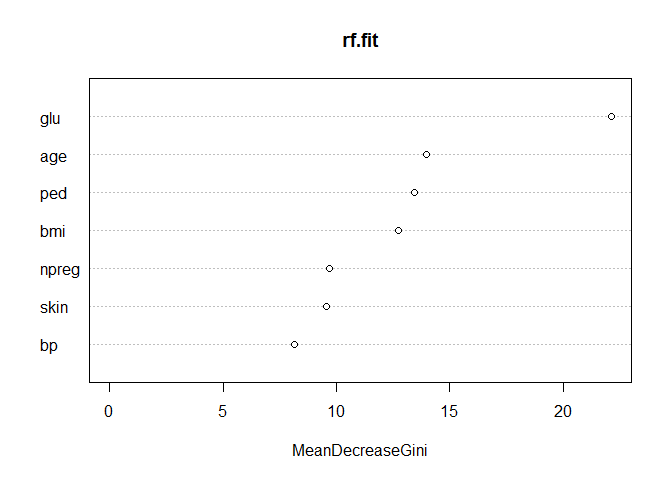

Random Forest
================

``` r
library(MASS)
library(randomForest)
```

    ## randomForest 4.6-14

    ## Type rfNews() to see new features/changes/bug fixes.

``` r
library(caret)
```

    ## Loading required package: lattice

    ## Loading required package: ggplot2

    ## 
    ## Attaching package: 'ggplot2'

    ## The following object is masked from 'package:randomForest':
    ## 
    ##     margin

``` r
data(Pima.tr)
data(Pima.te)
head(Pima.tr)
```

    ##   npreg glu bp skin  bmi   ped age type
    ## 1     5  86 68   28 30.2 0.364  24   No
    ## 2     7 195 70   33 25.1 0.163  55  Yes
    ## 3     5  77 82   41 35.8 0.156  35   No
    ## 4     0 165 76   43 47.9 0.259  26   No
    ## 5     0 107 60   25 26.4 0.133  23   No
    ## 6     5  97 76   27 35.6 0.378  52  Yes

``` r
set.seed(12345)
rf.fit = randomForest(type~npreg+glu+bp+skin+bmi+ped+age,
                      data=Pima.tr, mtry=floor(sqrt(7)),
                      ntree=500, importance=TRUE)
rf.fit
```

    ## 
    ## Call:
    ##  randomForest(formula = type ~ npreg + glu + bp + skin + bmi +      ped + age, data = Pima.tr, mtry = floor(sqrt(7)), ntree = 500,      importance = TRUE) 
    ##                Type of random forest: classification
    ##                      Number of trees: 500
    ## No. of variables tried at each split: 2
    ## 
    ##         OOB estimate of  error rate: 29%
    ## Confusion matrix:
    ##      No Yes class.error
    ## No  109  23   0.1742424
    ## Yes  35  33   0.5147059

mtry = number of features in each tree

``` r
test_x = Pima.te[c("npreg","glu","bp","skin","bmi","ped","age")]
test_y = Pima.te$type
y_pred = predict(rf.fit, test_x)
```

``` r
table(y_pred, test_y)
```

    ##       test_y
    ## y_pred  No Yes
    ##    No  190  46
    ##    Yes  33  63

``` r
importance(rf.fit)
```

    ##              No        Yes MeanDecreaseAccuracy MeanDecreaseGini
    ## npreg  9.352642 -0.1440421             7.497515         9.681226
    ## glu   14.974433 16.5894517            21.298822        22.135037
    ## bp     3.707946 -7.9710952            -1.601519         8.133086
    ## skin   1.548192  1.5770043             2.046157         9.549120
    ## bmi    2.338782  8.2634998             6.973581        12.731324
    ## ped    7.756132  2.7246304             6.965008        13.442938
    ## age   14.436733  4.8241120            13.660634        13.960162

각 변수들의 중요성(Gini 지수 감소 정도) 이 중요성을 그래프화 해보면

``` r
varImp(rf.fit)
```

    ##              No       Yes
    ## npreg  4.604300  4.604300
    ## glu   15.781942 15.781942
    ## bp    -2.131574 -2.131574
    ## skin   1.562598  1.562598
    ## bmi    5.301141  5.301141
    ## ped    5.240381  5.240381
    ## age    9.630423  9.630423

``` r
varImpPlot(rf.fit, type=2)
```


