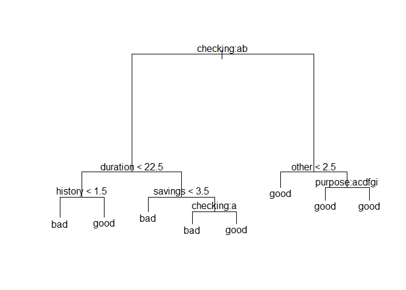
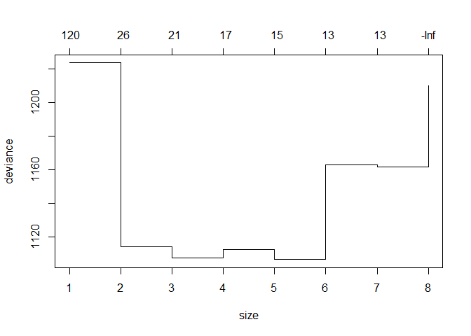
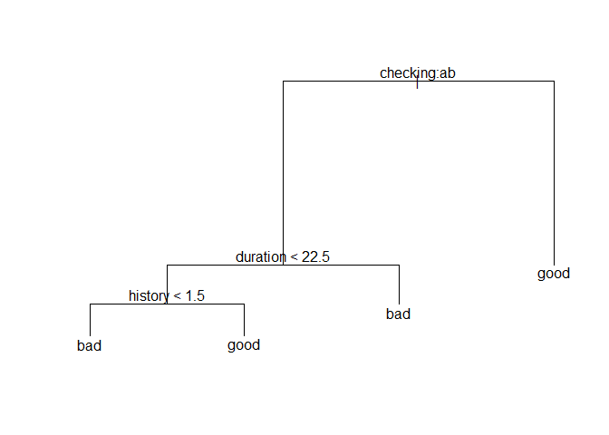
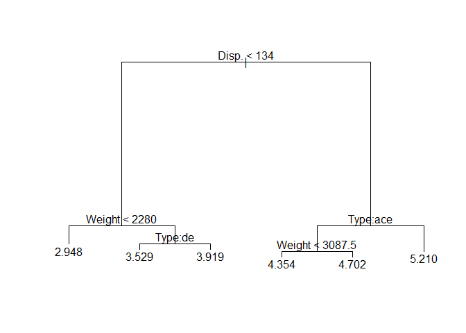

Tree model
================

``` r
load("C:/Users/Choi Sung Wook/Desktop/대학원/머신러닝 dataset/german.Rdata")
```

``` r
str(german)
```

    ## 'data.frame':    1000 obs. of  21 variables:
    ##  $ checking: Factor w/ 4 levels "1","2","3","4": 1 2 4 1 1 4 4 2 4 2 ...
    ##  $ duration: num  6 48 12 42 24 36 24 36 12 30 ...
    ##  $ history : chr  "4" "2" "4" "2" ...
    ##  $ purpose : Factor w/ 10 levels "0","1","2","3",..: 4 4 7 3 1 7 3 2 4 1 ...
    ##  $ amount  : num  1169 5951 2096 7882 4870 ...
    ##  $ savings : chr  "5" "1" "1" "1" ...
    ##  $ employed: Factor w/ 5 levels "1","2","3","4",..: 5 3 4 4 3 3 5 3 4 1 ...
    ##  $ installp: num  4 2 2 2 3 2 3 2 2 4 ...
    ##  $ marital : Factor w/ 4 levels "1","2","3","4": 3 2 3 3 3 3 3 3 1 4 ...
    ##  $ coapp   : Factor w/ 3 levels "1","2","3": 1 1 1 3 1 1 1 1 1 1 ...
    ##  $ resident: num  4 2 3 4 4 4 4 2 4 2 ...
    ##  $ property: Factor w/ 4 levels "1","2","3","4": 1 1 1 2 4 4 2 3 1 3 ...
    ##  $ age     : num  67 22 49 45 53 35 53 35 61 28 ...
    ##  $ other   : chr  "3" "3" "3" "3" ...
    ##  $ housing : Factor w/ 3 levels "1","2","3": 2 2 2 3 3 3 2 1 2 2 ...
    ##  $ existcr : num  2 1 1 1 2 1 1 1 1 2 ...
    ##  $ job     : Factor w/ 4 levels "1","2","3","4": 3 3 2 3 3 2 3 4 2 4 ...
    ##  $ depends : num  1 1 2 2 2 2 1 1 1 1 ...
    ##  $ telephon: Factor w/ 2 levels "1","2": 2 1 1 1 1 2 1 2 1 1 ...
    ##  $ foreign : Factor w/ 2 levels "1","2": 1 1 1 1 1 1 1 1 1 1 ...
    ##  $ good.bad: Factor w/ 2 levels "bad","good": 2 1 2 2 1 2 2 2 2 1 ...

``` r
head(german[, c(1:6,21)], 3)
```

    ##   checking duration history purpose amount savings good.bad
    ## 1        1        6       4       3   1169       5     good
    ## 2        2       48       2       3   5951       1      bad
    ## 3        4       12       4       6   2096       1     good

``` r
library(tree)
```

    ## Warning: package 'tree' was built under R version 3.6.1

``` r
colnames(german)
```

    ##  [1] "checking" "duration" "history"  "purpose"  "amount"   "savings" 
    ##  [7] "employed" "installp" "marital"  "coapp"    "resident" "property"
    ## [13] "age"      "other"    "housing"  "existcr"  "job"      "depends" 
    ## [19] "telephon" "foreign"  "good.bad"

``` r
german.tr = tree(good.bad ~ . , german)
```

``` r
plot(german.tr)
text(german.tr)
```

 분할 규칙 - yes=왼쪽, no=오른쪽 - 이산형인 경우 a,b,c,d 로 표시 (checking:ab -처음or두번째 범주) 수직선의 길이 : 분할 후 불순도 감소의 정도.

``` r
german.tr
```

    ## node), split, n, deviance, yval, (yprob)
    ##       * denotes terminal node
    ## 
    ##  1) root 1000 1222.00 good ( 0.30000 0.70000 )  
    ##    2) checking: 1,2 543  745.40 good ( 0.44199 0.55801 )  
    ##      4) duration < 22.5 306  394.90 good ( 0.34641 0.65359 )  
    ##        8) history < 1.5 28   31.49 bad ( 0.75000 0.25000 ) *
    ##        9) history > 1.5 278  342.30 good ( 0.30576 0.69424 ) *
    ##      5) duration > 22.5 237  324.50 bad ( 0.56540 0.43460 )  
    ##       10) savings < 3.5 196  259.80 bad ( 0.62245 0.37755 ) *
    ##       11) savings > 3.5 41   49.57 good ( 0.29268 0.70732 )  
    ##         22) checking: 1 17   23.03 bad ( 0.58824 0.41176 ) *
    ##         23) checking: 2 24   13.77 good ( 0.08333 0.91667 ) *
    ##    3) checking: 3,4 457  355.40 good ( 0.13129 0.86871 )  
    ##      6) other < 2.5 76   91.46 good ( 0.28947 0.71053 ) *
    ##      7) other > 2.5 381  247.30 good ( 0.09974 0.90026 )  
    ##       14) purpose: 0,2,3,5,6,9 324  234.20 good ( 0.11728 0.88272 ) *
    ##       15) purpose: 1,4,8 57    0.00 good ( 0.00000 1.00000 ) *

-   표시는 terminal node 나타냄 ex. 8번: checking=1,2 & duration&lt;22.5 & history&lt;1.5 인 노드 (총 28개) --&gt; bad(0) 가 75% , good(1) 이 25% 이다

``` r
summary(german.tr)
```

    ## 
    ## Classification tree:
    ## tree(formula = good.bad ~ ., data = german)
    ## Variables actually used in tree construction:
    ## [1] "checking" "duration" "history"  "savings"  "other"    "purpose" 
    ## Number of terminal nodes:  8 
    ## Residual mean deviance:  1.004 = 996.1 / 992 
    ## Misclassification error rate: 0.235 = 235 / 1000

``` r
german.cv = cv.tree(german.tr, FUN=prune.tree)
```

가지치기

``` r
plot(german.cv)
```

 10-fold cross-validation 의 결과로, 나무모형 크기 변화에 따른 deviance 의 변화를 보여주는 그래프. 최종 노드 수가 3~4개 일때 deviance 가 가장 작은 최적의 나무 모형 (CV 는 자료를 임의 분할해 분석하므로, 분석때마다 다른 결과 가능)

``` r
german.best.4 = prune.tree(german.tr, best=4)
german.best.4
```

    ## node), split, n, deviance, yval, (yprob)
    ##       * denotes terminal node
    ## 
    ## 1) root 1000 1222.00 good ( 0.3000 0.7000 )  
    ##   2) checking: 1,2 543  745.40 good ( 0.4420 0.5580 )  
    ##     4) duration < 22.5 306  394.90 good ( 0.3464 0.6536 )  
    ##       8) history < 1.5 28   31.49 bad ( 0.7500 0.2500 ) *
    ##       9) history > 1.5 278  342.30 good ( 0.3058 0.6942 ) *
    ##     5) duration > 22.5 237  324.50 bad ( 0.5654 0.4346 ) *
    ##   3) checking: 3,4 457  355.40 good ( 0.1313 0.8687 ) *

``` r
summary(german.best.4)
```

    ## 
    ## Classification tree:
    ## snip.tree(tree = german.tr, nodes = c(5L, 3L))
    ## Variables actually used in tree construction:
    ## [1] "checking" "duration" "history" 
    ## Number of terminal nodes:  4 
    ## Residual mean deviance:  1.058 = 1054 / 996 
    ## Misclassification error rate: 0.255 = 255 / 1000

(오분류 비율은 0.235 에서 0.255 로 증가)

``` r
plot(german.best.4)
text(german.best.4)
```



``` r
head(predict(german.best.4, german, type="vector"))
```

    ##         bad      good
    ## 1 0.3057554 0.6942446
    ## 2 0.5654008 0.4345992
    ## 3 0.1312910 0.8687090
    ## 4 0.5654008 0.4345992
    ## 5 0.5654008 0.4345992
    ## 6 0.1312910 0.8687090

``` r
head(predict(german.best.4, german, type="class"))
```

    ## [1] good bad  good bad  bad  good
    ## Levels: bad good

만든 모형을 이용해 예측을 수행

``` r
library(SemiPar)
```

    ## Warning: package 'SemiPar' was built under R version 3.6.1

``` r
data(fuel.frame)
head(fuel.frame)
```

    ##           car.name Weight Disp. Mileage     Fuel  Type
    ## 1   Eagle Summit 4   2560    97      33 3.030303 Small
    ## 2    Ford Escort 4   2345   114      33 3.030303 Small
    ## 3   Ford Festiva 4   1845    81      37 2.702703 Small
    ## 4    Honda Civic 4   2260    91      32 3.125000 Small
    ## 5  Mazda Protege 4   2440   113      32 3.125000 Small
    ## 6 Mercury Tracer 4   2285    97      26 3.846154 Small

``` r
fuel.tr = tree(Fuel~Weight + Disp. + Type, data=fuel.frame)
fuel.tr
```

    ## node), split, n, deviance, yval
    ##       * denotes terminal node
    ## 
    ##  1) root 60 33.8600 4.210  
    ##    2) Disp. < 134 25  4.6780 3.499  
    ##      4) Weight < 2280 6  0.1133 2.948 *
    ##      5) Weight > 2280 19  2.1670 3.673  
    ##       10) Type: Small,Sporty 12  1.2630 3.529 *
    ##       11) Type: Compact 7  0.2326 3.919 *
    ##    3) Disp. > 134 35  7.5040 4.718  
    ##      6) Type: Compact,Medium,Sporty 25  2.7610 4.521  
    ##       12) Weight < 3087.5 13  1.1540 4.354 *
    ##       13) Weight > 3087.5 12  0.8522 4.702 *
    ##      7) Type: Large,Van 10  1.3590 5.210 *

``` r
plot(fuel.tr)
text(fuel.tr)
```



반응변수가 연속형 --&gt; regression tree
